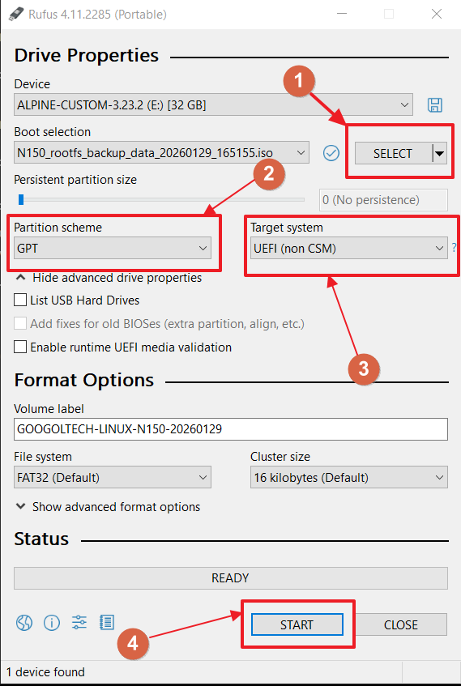
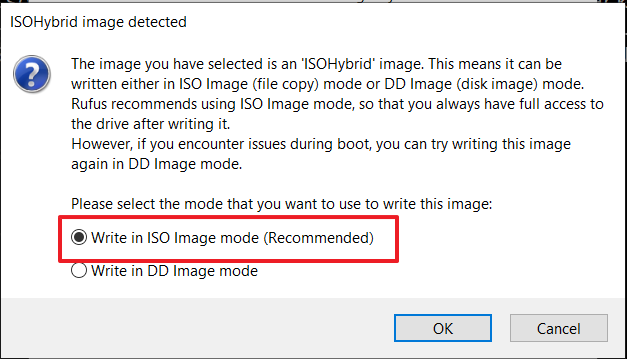
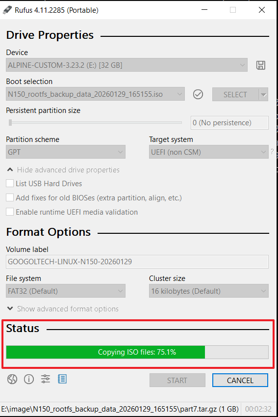
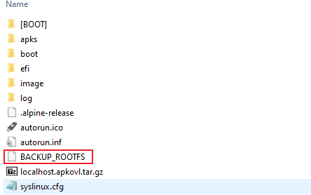

# 文档更改记录

| INDEX | 版本   | 更改内容 |
| ----- | ------ | ----     |
| 1     | V1.0.0 | 新建文档 |

# 背景

本文档用于说明在 UEFI 引导架构下，GNS-N150 平台与基于传统 BIOS 引导的 GNS-J1900 平台在系统烧录、备份及还原流程上的差异，并阐述对应方案的设计动机与实现原则。

在硬件平台完全一致的前提下，操作系统（包括 Windows 和 Linux）均可通过整盘克隆方式实现系统的完整备份与还原。该方式实现简单，依赖最少，适用于项目早期系统尚未定型、烧录与还原流程尚未完善的阶段。

但整盘克隆属于字节级拷贝，当目标硬盘容量超过 16 GB 后，镜像制作与还原耗时显著增加，整体效率较低，不适合批量部署或频繁升级维护场景。因此，有必要引入更高效的系统备份与还原机制。

为提升效率，本项目采用基于分区结构的备份与还原方案。该方案首先复现目标系统的分区布局与文件系统格式，然后仅对各分区中的有效数据进行复制。相较于整盘拷贝，该方式可显著减少无效数据处理时间，但需要实现较为复杂的自动化流程。一旦流程稳定，后续系统烧录与还原的时间成本将明显降低。

备份与还原逻辑运行于一个从 U 盘启动的最小化 Linux 环境中。该环境不承载任何业务功能，其唯一职责是在启动后对内置存储设备执行系统备份或还原操作，完成后等待用户重启系统。

在平台差异方面，GNS-J1900 使用 32 GB 硬盘，采用 BIOS 引导方式，运行 TinyCore Linux；而 GNS-N150 采用 UEFI 引导并使用更新的 Intel N150 处理器。
由于 TinyCore Linux 过于精简，缺乏对新平台所需的完整驱动及固件支持，无法满足 N150 平台的启动要求，因此在 GNS-N150 上选择 Alpine Linux 作为备份与还原系统的运行环境。Alpine Linux 在保持体积较小的同时，提供了较完整的处理器支持、固件加载能力及 UEFI 启动支持。

需要注意的是，GNS-J1900 不支持 UEFI 引导模式。在 UEFI 模式下，该平台上电后无法正常显示 BIOS 启动画面，只能通过特定按键序列
`Delete -> F9 -> Enter -> F10 -> Enter`
恢复至默认 BIOS 启动配置（可通过数字键盘 NumLock 指示灯状态判断上电情况）。基于该限制，当前阶段无法将 GNS-J1900 与 GNS-N150 统一到同一启动镜像中。

综上，由于引导方式、处理器平台及系统支持能力存在根本差异，GNS-N150 与 GNS-J1900 将分别维护独立的系统镜像及对应内核版本。

# GNS Linux 镜像文件更新流程说明

GNS Linux 镜像更新通常包含以下阶段：

1. 更新需求确认

镜像更新需求应来源于可追溯、可审计的正式渠道，例如：

* Redmine 任务
* 邮件记录
* GitLab Issue 等

不建议以口头沟通、微信等即时聊天记录等非正式方式作为唯一需求来源，以避免需求歧义或后期无法追溯。

2. 基准镜像选择与安装

除非从零开始构建系统镜像，否则更新流程应基于最近一个已验证稳定的镜像版本作为基准镜像。

具体步骤如下：

    a. 选择一个已测试稳定的镜像版本作为基准

    b. 选取一台 GNS 控制器

    c. 在该控制器上完整安装基准镜像，为后续组件集成提供基础环境

3. 更新内容准备与集成

根据更新需求，将相关组件集成至控制器系统中。更新内容通常包括但不限于：

* 内核或内核模块
* 驱动程序
* CODESYS 运行环境
* 动态链接库
* 系统脚本及业务组件

业务组件主要分布在 /opt/ 分区，其中以下两个目录更新频率较高：

* /opt/codesyscontrol/
    
    存放 3S CODESYS 的可执行文件、配置文件及动态链接库等内容

* /opt/googoltech/

    存放固高科技自研的驱动程序、动态链接库、二进制可执行文件及系统脚本等内容

自动化离线镜像打包机制说明   

针对上述高频更新目录，已提供自动化离线镜像打包机制。   
该机制通过服务器端自动化流程，将指定目录内容直接集成至基准镜像中并生成新的发布镜像。   

使用自动化打包系统生成的镜像时，可跳过后续的人工功能验证及 U 盘备份生成步骤，从而降低人工操作风险。   

系统关键文件的 Git 白名单管理要求  

对于 GNS 控制器，涉及系统行为、启动流程、硬件配置及运行策略的系统关键文件，必须纳入 Git 白名单进行版本追踪，以确保变更的可审计性、可回溯性和可复现性。

在对系统关键文件进行修改前，需通过以下脚本将系统切换至 Git 追踪模式：

```bash
    /opt/googoltech/scripts/googol_set_mode.sh 2
```

在 Git 追踪模式下，对白名单内系统关键文件的修改需执行 Git 提交，确保每一次变更均有明确记录。

完成修改并确认提交后，需将系统恢复至正常运行模式：

```bash
    /opt/googoltech/scripts/googol_set_mode.sh 1
```

版本信息与更新日志维护要求   

所有镜像更新内容需同步维护系统版本信息与更新日志：

更新记录需详细记录至：

```bash
    /etc/googoltech_gns_os_release
```


系统版本号需同步更新至：  

```bash
    /usr/lib/os-release
```


以确保系统镜像版本信息的一致性和可识别性。

4. 功能与稳定性验证

完成更新内容集成后，应在控制器上执行必要的功能验证与稳定性测试，以确保更新内容满足预期需求，且未引入新的系统风险。

5. 单元测试与系统一致性校验

a. 控制器更新完成后，将执行组件单元测试进行初步验证。

相关检测脚本如下：

```bash
    /opt/googoltech/scripts/googol_release_check.sh -c
```

b. 在验证通过后，单元测试脚本将进一步检查系统是否符合发布条件。  

c. 确认无误后，系统将自动重启，并从备份 U 盘启动，将当前系统文件备份取出。   

d. 随后，将备份得到的系统文件与基准镜像一并上传至镜像打包服务器，用于生成新的发布镜像。   

备份 U 盘的制作流程将在后续章节中说明。  

6. 镜像构建

对于涉及以下内容的更新：

* 内核或内核模块更新
* 系统配置调整
* 系统组件包更新
* 文件分布较分散、耦合性较强的大范围修改

通常采用 U 盘方式自动备份当前系统文件系统，并据此构建新的系统镜像。

对于仅涉及 /opt 分区业务组件升级的场景，建议优先使用自动化镜像打包服务，以减少人工干预并降低出错概率。

7. 镜像发布与交付

生成的新镜像需上传至文件共享服务器，统一存放路径为：

```
    \\192.168.201.13\共享文件夹\linux镜像文件
```

镜像文件命名应清晰体现平台类型、版本号及发布日期信息。

8. 升级执行与回退保障

从文件共享服务器下载目标镜像后，制作升级 U 盘并执行系统升级。

如有必要，在烧录新系统前应提前备份原有系统镜像，以确保在升级失败或异常情况下可快速回退。

# 烧录系统

## 环境准备

进行 GNS-N150 系统的烧录与备份操作前，需要准备并确认以下硬件与环境条件：

* GNS-N150 控制器 ×1
* USB 键盘 ×1
* 带 DP 接口的显示器 ×1
* DP 视频连接线 ×1
* U 盘 ×1（需提前格式化为 FAT/FAT32 文件系统）
* GNS-N150 专用 24V 电源 ×1

以上设备均为执行烧录与备份流程的必要条件，任一项缺失将导致操作无法正常进行。

上述设备缺一不可。

## U盘启动盘制作（Windows 环境）

1. 从共享目录
   `\\192.168.201.13\共享文件夹\linux镜像文件\N150-System-Images`
   拷贝所需的 ISO 镜像文件 至本地或确认可直接访问该目录。

2. 在 Windows 系统中以管理员权限启动 Rufus 软件。
   Rufus 可在以下共享目录中获取：
   `\\192.168.201.13\共享文件夹\linux镜像文件\N150-System-Images\01-Infrastructures`

3. 将 U 盘接入 Windows 主机。为避免写入过程被拦截，建议临时关闭系统安全防护或防火墙。
   按照下图所示，在 Rufus 中选择并加载对应的 ISO 烧录镜像。

<!--
<div align="center"> 
     
</div>
\begin{center}
\includegraphics[width=0.4\linewidth]{pictures/1.PNG}
\end{center}
-->
{width=50%}

4. 点击 START 后，在弹出的模式选择对话框中，选择
   Write in ISO Image mode。

<!--
<div align="center"> 
    
</div>
\begin{center}
\includegraphics[width=0.8\linewidth]{pictures/2.PNG}
\end{center}
-->
{width=50%}

5. 点击 OK 确认后，等待烧录过程完成，并观察进度条状态。

<!--
<div align="center">
     
</div>
\begin{center}
\includegraphics[width=0.8\linewidth]{pictures/3.PNG}
\end{center}
-->
{width=50%}

6. 当进度条显示 100%（如下图所示）后，在 Windows 设备管理器 / 任务栏中执行
   “安全移除硬件” 操作。 **确认系统提示可以移除设备后，方可拔出 U 盘。**

<!--
<div align="center">
    
</div>
\begin{center}
\includegraphics[width=0.8\linewidth]{pictures/4.PNG}
\end{center}
-->
{width=50%}

7. 将制作完成的 U 盘插入 GNS-N150 控制器，重新上电并在启动过程中按住 Delete 键，进入 UEFI 设置界面。
   后续启动项配置及启动流程详见下一节说明。

# 系统备份流程（GNS-N150）

1. 在已完成烧录的 U 盘根目录下，新建一个不带任何后缀名的空文件，命名为
   BACKUP_ROOTFS。 文件位置及状态应如下图所示：

<!--
<div align="center">
    
</div>
\begin{center}
\includegraphics[width=0.8\linewidth]{pictures/5.PNG}
\end{center}
-->
{width=50%}


2. 将 U 盘插入 GNS-N150 控制器的 USB 接口，重新上电启动设备。

3. 在上电启动过程中，按住 Delete 键，进入 UEFI 设置界面。

4. 在 UEFI 菜单中，使用键盘导航至
   BOOT -> BOOT FROM，并选择 U 盘对应的启动项。

5. 确认启动后，观察显示器输出，系统将自动进入备份流程。
   在此过程中无需人工干预，请等待备份任务执行完成。

6. 备份完成后，系统将自动断电。断电后取下 U 盘。
   此时在 U 盘根目录下应新增一个目录，命名形式为：
   N150_rootfs_backup_data_XXXX
   该目录中包含当前系统的硬盘数据备份及分区结构信息。

7. 进入 U 盘自带的 image 目录，将其中原有的
   N150_rootfs_backup_data_XXXX
   目录删除或重命名（例如重命名为 01-N150_rootfs_backup_data_XXXX）。
   随后将新生成的备份目录移动至 image 目录中。

最终需确保：
**U 盘中仅存在一个目录，其名称以 N150_rootfs_backup_data_XXXX 开头。**

8. 删除此前在 U 盘根目录下创建的 BACKUP_ROOTFS 文件。
   至此，该 U 盘即可用于在其他 GNS-N150 设备上执行系统还原操作，实现系统复制。

# 其他注意事项

1. 镜像不通用性说明
   由于 GNS-N150 采用 UEFI 引导架构，而 GNS-J1900 系列控制器采用基于 BIOS + MBR 的引导方式，
   两者在引导机制与分区布局上存在根本差异。 因此，目前 N150 与 J1900 的系统镜像互不通用，需分别维护。

2. U 盘可用空间要求
   在执行系统备份操作前，需确保 U 盘剩余可用空间不少于 4 GB。
   若可用空间小于该阈值，备份流程将直接失败并给出相应提示。

3. 调试模式（DEBUG）说明
   在完成 U 盘制作后，如在 U 盘根目录下额外创建一个不带后缀名的空文件 DEBUG，
   系统从该 U 盘启动后将不会进入烧录或备份自动流程，而是直接进入命令行调试模式，
   用于开发人员调试烧录与备份相关功能。

4. 日志生成说明
   在烧录或备份流程执行完成后，U 盘中将自动生成 log 目录，
   该目录包含本次烧录或备份过程中的完整运行日志，可用于问题排查与过程追溯。
